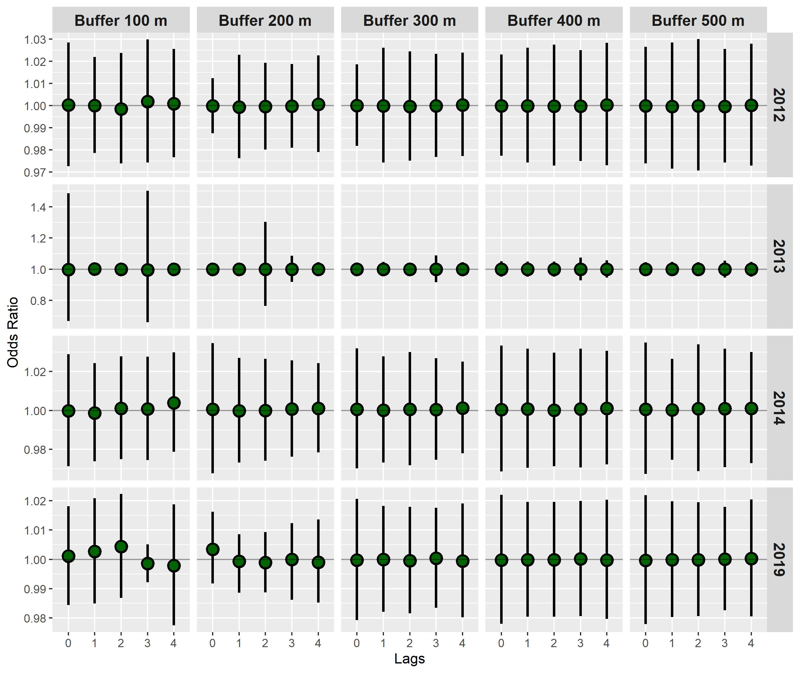

class: center
```{r xaringan-fit-screen, echo=FALSE}
xaringanExtra::use_fit_screen()
```

```{r xaringanExtra, echo = FALSE}
xaringanExtra::use_progress_bar(color = "#0051BA", location = "top")
```

```{r xaringan-tachyons, echo=FALSE}
xaringanExtra::use_tachyons()
```

```{r share-again, echo=FALSE}
xaringanExtra::use_share_again()
```

```{r xaringan-logo, echo=FALSE}
xaringanExtra::use_logo(
  image_url = "http://www.fcb.uanl.mx/nw/images/logo_fcb.png",
  position = xaringanExtra::css_position(top = "1em", right = "1em")
)
```

# **Introducción**
<hr style="height:2px;border-width:0;color:#330019;background-color:#330019">


.tiny[.blue[.footnote[https://ais.paho.org/phip/viz/cha_cd_vectorborndiseases.asp]]]

---
class: center
# **Introducción**
<hr style="height:2px;border-width:0;color:#330019;background-color:#330019"> 
<figure>
  
    </figcaption>
</figure>

.tiny[.blue[.footnote[Roiz et al. 2018; WHO, 2017]]]

---
class: center
# **Hotspots de la Transmisión del Dengue**
<hr style="height:2px;border-width:0;color:#330019;background-color:#330019">


.tiny[.blue[.footnote[OPS, 2019]]]

---
class: center
# **Hotspots de la Transmisión del Dengue**
<hr style="height:2px;border-width:0;color:#330019;background-color:#330019">

&nbsp;

.pull-left[

.large[.justify-left[.blue[Los ***hotspots*** de las arbovirosis transmitidas por ***Aedes aegypti*** son definidas como aquellas áreas donde se concentra la mayor carga de la transmisión de los virus del dengue, chikungunya y/ó zika]]]

]
.pull-right[
.blue[Hotspots del área urbana de Veracruz]

]


.tiny[.blue[.footnote[Bisanzio  et al 2017; 
Dzul-Manzanilla et al 2021.]]]

---
class: center,
# **Justificación**
<hr style="height:2px;border-width:0;color:#330019;background-color:#330019">

&nbsp;

.pull-left[

.large[.justify-left[.blue[Teóricamente, de acuerdo a la ley de Pareto 80/20, si el 80% de la transmisión se concentra en el 20% del área urbana, la focalización de las acciones en el 20% del área, permitiría obtener reducciones del 80% de la carga de la enfermedad.]]]

]
.pull-right[
.blue[Hotspots del área urbana de Xalapa]

]
---
# **Justificación**
<hr style="height:2px;border-width:0;color:#330019;background-color:#330019">


---
# **Hipótesis**
<hr style="height:2px;border-width:0;color:#330019;background-color:#330019"> 

[Las arbovirosis transmitidas por ***Aedes aegypti*** presentan concordancia espacial en las áreas de mayor intensidad de transmisión (hotspots), existe mayor abundancia del vector en las casas alrededor de los casos positivos que en las casas de los casos negativos y el tamaño de muestra de ovitrampas por manzana no tiene impacto en la abundancia del vector del dengue por manzana]()

&nbsp;

&nbsp;
# **Objetivo General**
<hr style="height:2px;border-width:0;color:#330019;background-color:#330019"> 

[Realizar el análisis espacio-temporal para identificar los puntos calientes (hotspots) de la transmisión de los virus del DENV, CHIKV y ZIKV en México.]()


---
# **Objetivos Específicos**
<hr style="height:2px;border-width:0;color:#330019;background-color:#330019"> 

&nbsp;
- [Determinar los hotspots de DENV, CHIKV y ZIKV en localidades endémicas de México y la concordancia espacial de los hotspots de transmisión de DENV, CHIKV y ZIKV.]()

&nbsp;
- [Determinar el efecto del tamaño de muestra del número de ovitrampas por manzana en la abundancia de huevos de ***Aedes aegypti***]()

&nbsp;
- [Determinar si la abundancia del vector y de huevos son diferentes en las casas alrededor de los casos positivos a dengue (casos) y las casas alrededor de los casos negativos (controles).]()


---
class: center,
# **Objetivo 1. Sitio de Estudio**
<hr style="height:2px;border-width:0;color:#330019;background-color:#330019">


---
# Hotspots de la Transmisión de Dengue
<hr style="height:2px;border-width:0;color:#330019;background-color:#330019">
.pull-left[
```{r, dpi=300,echo=FALSE, fig.align ="center", out.width = "100%"}
DiagrammeR::grViz("digraph {

  # graph definitions
  graph [layout = dot, rankdir = TB]
  
  # node definitions
  node [shape = rectangle, style = filled, color = grey] 
  
  # flowchart for hotspots
  sinave [label = 'SINAVE',  fillcolor = 'SeaGreen', color = 'white', fontcolor = 'white']
  denv [label = 'Bases de DENV',  fillcolor = 'SeaGreen', color = 'white', fontcolor = 'white']
  geocode [label = 'Geocodificación',  fillcolor = 'SeaGreen', color = 'white', fontcolor = 'white']
  cases_ageb [label = 'Casos por AGEBs']
  z_score [label = 'Z-score']
  gi [label = 'Estadístico Espacial Local (Gi*)']
  bonferroni [label = 'Corrección de Bonferroni']
  hotspots [label = 'Hotspots', style = filled, color = orange]
  
  # flow chart for inegi
  inegi [label = 'INEGI', fillcolor = 'DeepSkyBlue', color = 'white', fontcolor = 'black']
  loc [label = 'Localidades Shapefile', fillcolor = 'DeepSkyBlue', color = 'white', fontcolor = 'black']
  ageb [label = 'AGEB Shapefile', fillcolor = 'DeepSkyBlue', color = 'white', fontcolor = 'black']
  loc_esp [label = 'Localidad de Ínteres', fillcolor = 'DeepSkyBlue', color = 'white', fontcolor = 'black']
  ageb_esp [label = 'AGEBs de la Localidad de Ínteres', fillcolor = 'DeepSkyBlue', color = 'white', fontcolor = 'black']
  mat [label = 'Matriz de Adjacencias', fillcolor = 'DeepSkyBlue', color = 'white', fontcolor = 'black']
  
  # edge definitions with the node IDs
  edge [color = black]
  sinave -> denv -> geocode -> cases_ageb -> z_score -> gi -> bonferroni -> hotspots 
  inegi -> {ageb, loc}
  loc -> loc_esp -> ageb_esp
  ageb -> ageb_esp
  ageb_esp -> mat
  mat -> cases_ageb 
 
  }", 
  height = 550)

```
]
.pull-right[
Estadístico Espacial Local $\color{#2ECC40}G_{\color{#2ECC40}i}^{\color{#2ECC40}*}$


$$\color{#2ECC40}G_{\color{#2ECC40}i}^{\color{#2ECC40}*} = \frac{\color{#FF4136}\sum_{\color{#FF4136}j \color{#FF4136}= \color{#FF4136}1}^\color{#FF4136}{n} \color{#FF4136}w_{\color{#FF4136}i\color{#FF4136}j}\color{#FF4136}x_{\color{#FF4136}j}}
{\color{#0074D9}\sum_{\color{#0074D9}j \color{#0074D9}= \color{#0074D9}1}^{\color{#0074D9}n} \color{#0074D9}x_{\color{#0074D9}j}}$$

donde:
 
$\color{#FF4136}\sum_{\color{#FF4136}j \color{#FF4136}= \color{#FF4136}1}^\color{#FF4136}{n} \color{#FF4136}w_{\color{#FF4136}i\color{#FF4136}j}\color{#FF4136}x_{\color{#FF4136}j}$ el numerador, es la suma de los valores $x_{j}$ de la localidad de interes de la unidad espacial de interes $x_{i}$ & 

$\frac{}{\color{#0074D9}\sum_{\color{#0074D9}j \color{#0074D9}= \color{#0074D9}1}^{\color{#0074D9}n} \color{#0074D9}x_{\color{#0074D9}j}}$ el denominador, es la suma de todos los valores $x$ en toda la localidad de interes.


]

---
class: center,
# **Objetivo 2. Sitio de Estudio**
<hr style="height:2px;border-width:0;color:#330019;background-color:#330019">

.pull-left[
.small[.justify-left[
- **Muestro Sistemático**
 - 1 manzana por cada 4 a 6 en zonas planas
 - 1 manzana por cada 2 a 4 en zonas con pendientes
 
- **Muestreo por autoselección**
 - una casa por cada lado de la manzana
- **Colecta semanal**

- **Captura en línea**
]
]
]

.pull-right[
.blue[Veracruz]
```{r,fig.align ="center",fig.width=5, fig.height=8,echo=FALSE, warning=FALSE, message=FALSE}
library(sf)
library(magrittr)
source('C:/Users/felip/OneDrive/cursos_impartidos/2021/foro_estadistica/3.Functions/block_surveillance.R')
path_coord <- "C:/Users/felip/Dropbox/cenaprece_datasets/30_veracruz/DescargaOvitrampasMesFco.txt"

blocks_surveillance(locality = "Veracruz",
                    cve_geo = "30",
                    path_coords = path_coord)

```
]
---

# **Modelo de Regresión**
<hr style="height:2px;border-width:0;color:#330019;background-color:#330019">


### $\color{#2ECC40}y{_\color{#2ECC40}i} = \color{#FF4136}\beta{_\color{#FF4136}0} + \color{#0074D9}\beta{_\color{#0074D9}1}\color{#0074D9}x + \color{#F4B400}\alpha{_\color{#F4B400}i} + \color{#6200B4}\epsilon{_\color{#6200B4}i}$

donde: 

$\color{#2ECC40}y{_\color{#2ECC40}i}$  es la variable de respuesta, es decir el número de huevos por ovitrampa

$\color{#FF4136}\beta{_\color{#FF4136}0}$ es el intercepto

$\color{#0074D9}\beta{_\color{#0074D9}1}\color{#0074D9}x$ es el coeficiente de la diferencia del número huevos entre los diferentes tamaños de muestra (se tomó como referencia la base de datos completa, cuatro ovitrampas por manzana).

$\color{#F4B400}\alpha{_\color{#F4B400}i}$ el efecto del intercepto aleatorio, anida las observaciones por sector, manzana, localidad y municipio.

$\color{#6200B4}\epsilon{_\color{#6200B4}i}$ representan el error, el cual incorporará la variabilidad natural del sistema biológico y el error observacional o de medición

Los modelos asumen que los interceptos aleatorios y el error son distribuidos independientemente e idénticos con media cero y una varianza.

Los modelos fueron implementados para cada combinación de año y semana.

---
class: center,
### **Objetivo 3. Relación Casos & Huevos del vector**
<hr style="height:2px;border-width:0;color:#330019;background-color:#330019">

```{r, dpi=300,echo=FALSE, fig.align ="center", out.width = "100%"}
DiagrammeR::grViz("digraph {

  # graph definitions
  graph [layout = dot, rankdir = TB]
  
  # node definitions
  node [shape = rectangle, style = filled, color = grey] 
  
  # flowchart for hotspots
  sinave [label = 'SINAVE',  fillcolor = 'SeaGreen', color = 'white', fontcolor = 'white']
  denv [label = 'Bases de DENV',  fillcolor = 'SeaGreen', color = 'white', fontcolor = 'white']
  age_den [label = '<= 12 & >= 65',  fillcolor = 'SeaGreen', color = 'white', fontcolor = 'white']
  year_den [label = '2012, 2013, 2014, 2019',  fillcolor = 'SeaGreen', color = 'white', fontcolor = 'white']
  
  geocode [label = 'Geocodificación',  fillcolor = 'SeaGreen', color = 'white', fontcolor = 'white']
  cases_ovitrap [label = 'Ovitrampas por Casos']
  
  
  # flow chart for inegi
  cenaprece [label = 'CENAPRECE', fillcolor = 'DeepSkyBlue', color = 'white', fontcolor = 'black']
  
  coord [label = 'Coordenadas', fillcolor = 'DeepSkyBlue', color = 'white', fontcolor = 'black']
  ovitraps [label = 'Ovitrampas', fillcolor = 'DeepSkyBlue', color = 'white', fontcolor = 'black']
  #
   semana_ano [label = 'Semana, Año']
  
  # edge definitions with the node IDs
  edge [color = black]
  sinave -> denv -> {age_den year_den} -> geocode -> cases_ovitrap
  
  cenaprece -> {coord, ovitraps} -> cases_ovitrap -> semana_ano
  
 
  }", 
  height = 550)

```


---
## **Modelo de Regresión**
<hr style="height:2px;border-width:0;color:#330019;background-color:#330019">


### $\color{#2ECC40}y{_\color{#2ECC40}i} = \color{#FF4136}\beta{_\color{#FF4136}0} + \color{#0074D9}\beta{_\color{#0074D9}1}\color{#0074D9}x + \color{#F4B400}\alpha{_\color{#F4B400}i} + \color{#6200B4}\epsilon{_\color{#6200B4}i}$

donde: 

$\color{#2ECC40}y{_\color{#2ECC40}i}$  es la variable de respuesta, caso = 1 y control = 0

$\color{#FF4136}\beta{_\color{#FF4136}0}$ es el intercepto de la formula y representa el valor de la 
ecuación cuando el número de huevos es cero.

$\color{#0074D9}\beta{_\color{#0074D9}1}\color{#0074D9}x$ es la pendiente de la ecuación y representa la diferencia entre las abundancia de huevos entre los casos y controles y la tasa de cambio en 𝑦 basado en una unidad de cambio en 𝑥 

$\color{#F4B400}\alpha{_\color{#F4B400}i}$ el efecto del intercepto aleatorio, anida las observaciones por sector, manzana, localidad y municipio.

$\color{#6200B4}\epsilon{_\color{#6200B4}i}$ representan el error, el cual incorporará la variabilidad natural del sistema biológico y el error observacional o de medición

Los modelos asumen que los interceptos aleatorios y el error son distribuidos independientemente e idénticos con media cero y una varianza

Los modelos fueron implementados para cada combinación de año, lags (lags0 a lags4) y buffers (100-500 
metros)
---
class: center, middle
# **Resultados**
<hr style="height:2px;border-width:0;color:#330019;background-color:#330019">

&nbsp;
- [Determinar los hotspots de DENV, CHIKV y ZIKV en localidades endémicas de México y la concordancia espacial de los hotspots de transmisión de DENV, CHIKV y ZIKV.]()


---
# **Análisis de Sensibilidad y Específicidad**
<hr style="height:2px;border-width:0;color:#330019;background-color:#330019">

```{r, echo=FALSE}
tibble::tibble(Localidad  = c("Acapulco",
                                   "Mérida",
                                   "Veracruz",
                                   "Cancún",
                                   "Tapachula",
                                   "Villahermosa",
                                   "Campeche",
                                   "Iguala",
                                   "Coatzacoalcos",
                                   "Promedio"),
                    sensibilidad1 = c(.67, .76, .71, .89, .79,
                                      .95, .71, .63, .8, .77),
               especificidad1 = c(.96, .91, .93, .93, .95, .95, .94, .98, .96, .95),
               sensibilidad2 = c(.61, .73, .38, .71, .33, .75, .5, .67, .33, .56),
               especificidad2 = c(.87, .82, .89, .82, .88, .86, .85, .93, .89, .87),
               sensibiliad3 = c(.68, .62, .38, .67, .33, .85, .31, .42, .36, .51),
               especificidad3 = c(.88, .82, .90, .83, .89, .88, 83, 92, .91, .87)) |>
    kableExtra::kable() |>
    kableExtra::kable_classic() |>
    kableExtra::add_header_above(c(" " = 1, "<=12 & >= 70 años de edad" = 2, "Distancia Euclideana" = 2, "Combinación edad & Distancia Euclideana" = 2))

```
---
class: center
# **Hotspots de la Transmisión de Dengue**
<hr style="height:2px;border-width:0;color:#330019;background-color:#330019">


---
# **Hotspots de la Transmisión de Dengue**
<hr style="height:2px;border-width:0;color:#330019;background-color:#330019">

```{r, echo=FALSE}
readxl::read_xlsx("tables/mmc2-tableS4-5.xlsx", sheet = 1, skip = 1) |> kableExtra::kable() 

```

---
class: center
# **Hotspots de Dengue & Chikungunya**
<hr style="height:2px;border-width:0;color:#330019;background-color:#330019">


---
class: center
# **Hotspots de Dengue & Zika**
<hr style="height:2px;border-width:0;color:#330019;background-color:#330019">


---
# **Concordancia Espacial de los Hotspots**
<hr style="height:2px;border-width:0;color:#330019;background-color:#330019">

```{r, echo=FALSE}
readxl::read_xlsx("tables/mmc2-tableS4-5.xlsx", sheet = 2) |> kableExtra::kable() |>
    kableExtra::kable_classic()

```


---
class: center, middle
# **Resultados**
<hr style="height:2px;border-width:0;color:#330019;background-color:#330019">

&nbsp;
- [Determinar el efecto del tamaño de muestra del número de ovitrampas por manzana en la abundancia de huevos de ***Aedes aegypti***]()

---
class: center
### **Ovirampas instaladas y manzanas muestradas**
<hr style="height:2px;border-width:0;color:#330019;background-color:#330019">


---
class: center
### **Ovirampas instaladas y manzanas muestradas**
<hr style="height:2px;border-width:0;color:#330019;background-color:#330019">


---
class: center
### **Comparación de Difentes Modelos**
<hr style="height:2px;border-width:0;color:#330019;background-color:#330019">


---
class: center
### **Resultados**
<hr style="height:2px;border-width:0;color:#330019;background-color:#330019">


---
class: center, middle
# **Resultados**
<hr style="height:2px;border-width:0;color:#330019;background-color:#330019">

&nbsp;
- [Determinar si la abundancia del vector y de huevos son diferentes en las casas alrededor de los casos positivos a dengue (casos) y las casas alrededor de los casos negativos (controles).]()

---
class: center, middle
## **Casos de Dengue Positivos & Negativos**
<hr style="height:2px;border-width:0;color:#330019;background-color:#330019">

.pull-left[
]

.pull-rigth[

```{r, echo=FALSE}
tibble::tibble(Año = c("2019", "2014", "2013", "2012", ""),
Positivo = c(262, 180, 88, 250, 270),
Negativo = c(189, 264, 189, 486, 1228),
Positivo2 = c(262, 180, 88, 250, 780),
Negativo2 = c(189, 264, 189, 486, 1228),
Positivo3 = c(255, 150, 77, 208, 690),
Negativo3 = c(146, 217, 170, 408, 941),
Positivo4 = c(109, 102, 59, 168, 504),
Negativo4 = c(109, 102, 59, 168, 504)) |>
kableExtra::kable() |>
kableExtra::kable_classic()
```
]

---
class: center
### **Relación entre casos y huevos**
<hr style="height:2px;border-width:0;color:#330019;background-color:#330019">
]


---
class: center, middle
# **Discusión**
<hr style="height:2px;border-width:0;color:#330019;background-color:#330019">

&nbsp;
- [Determinar el efecto del tamaño de muestra del número de ovitrampas por manzana en la abundancia de huevos de ***Aedes aegypti***]()

---
class: center
### **Relación entre casos y huevos**
<hr style="height:2px;border-width:0;color:#330019;background-color:#330019">

```{r, echo=FALSE}
tibble::tibble(Etapa = c("Huevo", "Larva", "Adulto"),
               Resultado =  c("No hay diferencia entre la abundancia de huevos y los casos/controles", "?", "No hay diferencia entre la abundancia de adultos y los casos/controles"),
               "Literarura a favor" = c("Bowman et al   2014,Chang et al 2015, Kwan et al 2017",
                                        "Chadee et al 2005, Sanchez et al 2006, Lin and Wen et al 2012, Pham et al 20011, Chavaroti-Nieto et al 2015, Vargas et al 2015","Mammen et al 2008, Honorio et al 2009,
Barbosa et al 2014, Bowman et al   2014, Chang et al 2015, Pepin et al 2015"),
               "Literarura en contra" = c("Ho et al 2005, Mello et al 2012, Alburquerque et al 2018, Betanzos-Reyes et al 2018", "Sulaiman et al 1996
Bowman et al   2014, Chang et al 2015", "Dibo et al 2008,Rubio-Palis et al 2011, Mello et al 2012, Yoon et al 2012, degener et a  2014, Pessanha et al 2014, Cromwell et al 2017, Cruz-Ferreira et al 2017, Perreira-Parra et al 2018")) |>
    kableExtra::kable() |>
    kableExtra::kable_classic()

```

---
class: center
# **Conclusiones**
<hr style="height:2px;border-width:0;color:#330019;background-color:#330019">

### - Es factible la identificación de los hotspots de transmisión en las localidades estudiadas

### - Existe una concordancia espacial entre DENV, CHIKV y ZIKV.

### - Muestrear una ovitrampa, dos ovitrampas o tres ovitrampas por manzana proporciona los mismos resultados que muestrear cuatro
ovitrampas por manzana.

### - (No hay diferencia entre la abundancia de huevos y adultos entre los casos y controles.)[]


---
class: center, middle
# **Productos Derivados de la Tesis**
<hr style="height:2px;border-width:0;color:#330019;background-color:#330019">


.pull-left[
]

.pull-rigth[

]

---
# Thanks!
<hr style="height:2px;border-width:0;color:#330019;background-color:#330019"> 

&nbsp;


- ***email***      :     [felipe.dzul.m@gmail.com]()

- ***celular***    :     [228 229 3419]()

- ***github***     :     [https://github.com/fdzul]()

- ***slides***     :     [https://tender-allen-e59734.netlify.app]()


.footnote[La presentación fue creada via [**xaringan**](https://github.com/yihui/xaringan),
[**revealjs**](https://revealjs.com/),
[remark.js](https://remarkjs.com), [**knitr**](http://yihui.name/knitr),
& [R Markdown](https://rmarkdown.rstudio.com) en [R]() & [RStudio](2.R_Scripts/libs/rstudio_leaflet/rstudio_leaflet.css).]